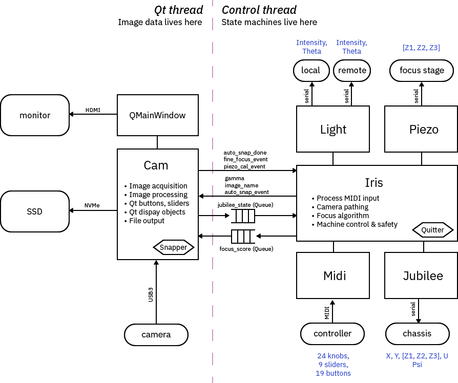

# Jubiris

IRIS customizations for Jubilee: read more at [this blog post](https://www.bunniestudios.com/blog/2024/control-and-autofocus-software-for-chip-level-microscopy/).

Top level file for controlling IRIS can be found at [miduet.py](./midi-ctrl/miduet.py).

Block diagram of the control software, as of [this commit](https://github.com/bunnie/jubiris/commit/65f168f4263c3c314d549c7d3f0408f404813f56):

## About IRIS

This repository is part of the IRIS project, an effort to make it easier to verify the construction of silicon chips.

Read more about IRIS at our [arXiv paper](https://arxiv.org/abs/2303.07406), or the latest [project update](https://www.bunniestudios.com/blog/?p=6937).

## Acknowledgements

This work was funded in part by NLnet’s [NGI0 Entrust](https://nlnet.nl/entrust/) fund, established with support from the European Commission’s Next Generation Internet Program, and my [Github Sponsors](https://github.com/sponsors/bunnie/).

